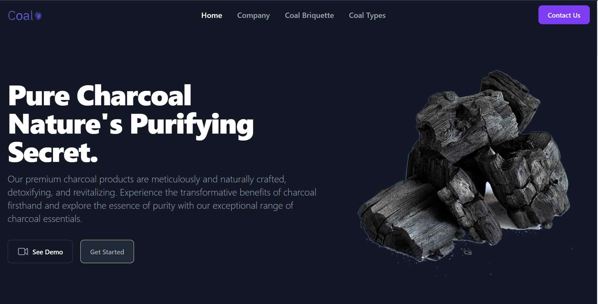

## Getting started

Make sure that you have [Node.js](https://nodejs.org/en/), [Tailwind CSS](https://tailwindcss.com/docs/installation) and [Flowbite](https://flowbite.com/docs/getting-started/quickstart/) installed.

1. Run `npm install` inside your terminal

2. Watch for files and compile Tailwind CSS + Flowbite:

```
npx tailwindcss -i ./input.css -o ./output.css --watch
```
